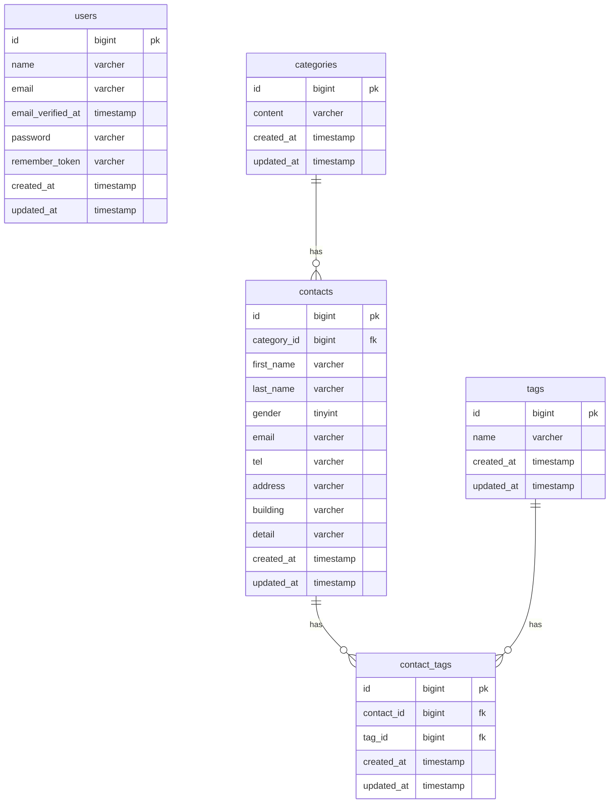

# COACHTECH お問い合わせフォーム

## 概要

- 一般ユーザーが利用する公開のお問い合わせフォームです。
- 誰でもお問い合わせを送信でき、管理者はログイン後にその内容を確認・管理します。

## ER図



## 環境構築手順

1.Laravel 10.xを指定してプロジェクトを作成

```bash
docker run --rm \
 -u "$(id -u):$(id -g)" \
 -v "$(pwd):/var/www/html" \
 -w /var/www/html \
 -e COMPOSER_CACHE_DIR=/tmp/composer_cache \
 laravelsail/php82-composer:latest \
 composer create-project laravel/laravel:^10.0 contact-form-app
```

2.プロジェクトディレクトリに移動

```bash
cd contact-form-app
```

3.Laravel Sailをインストール

```bash
docker run --rm \
    -u "$(id -u):$(id -g)" \
    -v "$(pwd):/var/www/html" \
    -w /var/www/html \
    -e COMPOSER_CACHE_DIR=/tmp/composer_cache \
    laravelsail/php82-composer:latest \
    composer require laravel/sail --dev
```

4.Sailの設定ファイルをパブリッシュ（MySQLを選択）

```bash
docker run --rm \
    -u "$(id -u):$(id -g)" \
    -v "$(pwd):/var/www/html" \
    -w /var/www/html \
    -e COMPOSER_CACHE_DIR=/tmp/composer_cache \
    laravelsail/php82-composer:latest \
    php artisan sail:install --with=mysql
```

5.env.ファイルの確認

- env.ファイルを開き、データベース接続情報が以下と一致していることを確認

```bash
DB_CONNECTION=mysql
DB_HOST=mysql
DB_PORT=3306
DB_DATABASE=laravel
DB_USERNAME=sail
DB_PASSWORD=password
```

6.phpMyAdminの追加

- compose.yaml を開き、mysql サービスの後に以下の設定を追加

```bash
 phpmyadmin:
        image: 'phpmyadmin:latest'
        ports:
            - '${FORWARD_PHPMYADMIN_PORT:-8080}:80'
        environment:
            PMA_HOST: mysql
            PMA_USER: '${DB_USERNAME}'
            PMA_PASSWORD: '${DB_PASSWORD}'
        networks:
            - sail
        depends_on:
            - mysql
```

※必ずmysqlとタグを合わせること

7.Sailをバックグラウンドで起動

```bash
./vendor/bin/sail up -d
```

- エイリアスを設定して 'sail' だけでコマンドを実行できるようにする

```bash
echo "alias sail='[ -f sail ] && bash sail || bash vendor/bin/sail'" >> ~/.zshrc
```

- シェルを再起動するか、新しいターミナルを開いてエイリアスを有効にする

```bash
exec $SHELL
```

8.アプリケーションキーの生成

```bash
sail artisan key:generate
```

9.フロントエンドのセットアップ

- 1.NPM依存パッケージのインストール

```bash
sai npm install
```

※必ずSailコンテナが起動していること

- 2.Tailwind CSSのインストール

```bash
sail npm install -D tailwindcss@^3.4.0 postcss autoprefixer
sail npm install alpinejs
```

- 3.設定ファイルの生成

```bash
sail npx tailwindcss init -p
```

- 4.Tailwind CSSのテンプレートパス設定
- tailwind.config.js を開き、以下のように設定

```bash
/** @type {import("tailwindcss").Config} */
export default {
  content: [
    "./resources/**/*.blade.php",
    "./resources/**/*.js",
    "./resources/**/*.vue",
  ],
  theme: {
    extend: {},
  },
  plugins: [],
}
```

- 5.提供リポジトリのresourcesディレクトリと入れ替え
  ①以下のリポジトリをクローン
    ```bash
    git clone https://github.com/coachtech-prepared-file/Preparedblade-ConfirmationTest-ContactForm.git
    ```
    ②explrer.exeでプロジェクトフォルダを開く
    ③プロジェクトフォルダ内のresourcesフォルダを削除
    ④クローンしたフォルダ内のresourcesフォルダを、プロジェクトフォルダ内にコピー
- 6.Vite開発サーバーの起動
  新しいターミナルを開き

```bash
sail npm run dev
```

※このターミナルは開いたままにしておく

## 使用技術

- OS:windows11
- PHP:8.2
- Laravel:10.x
- DB:MySQL 8.0
- Webサーバー:Nginx
- フロントエンド:Vite, Tailwind CSS ^3.4.0
- 開発ツール:Docker, Laravel Sail, phpMyAdmin

## APIエンドポイント一覧

- 応用
-
-

## 作成者

太田優子
